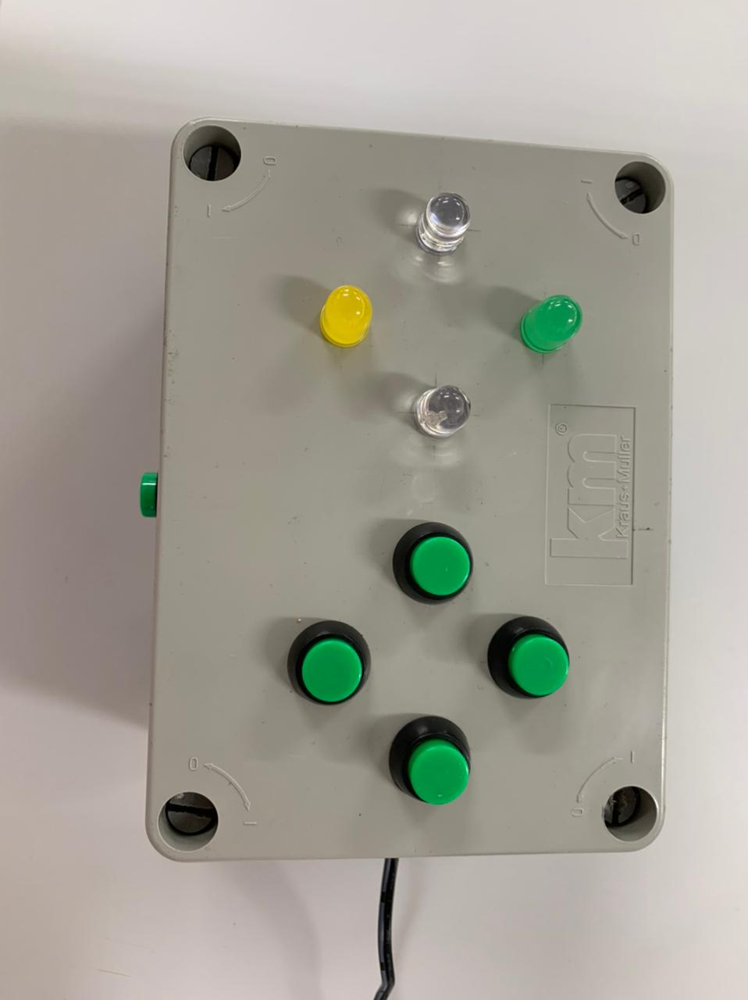

# Genius with arduino

In this repo, you'll see my version of Genius toy.

It was created using arduino and some eletronic components, like `push buttons, wires and LEDs`.

https://user-images.githubusercontent.com/75098594/193456998-4d8eb051-4487-4584-9b55-4238dc62a791.mp4

I created this project to a technology week from my former school. I was coursing eletronics, and as a way to show to new students what we were doing in this course, we made this project.

With the circuit and the code done, we made a simple box to put all inside, to abstract all the boring part, and let everyone to have fun with.

## How to play
In this game you need to follow the light sequence, if you miss the sequence, you lose.

To start, hold the side button untill top LEDs turn off, then click the buttons on the sequence.

https://user-images.githubusercontent.com/75098594/193457239-02979f71-c0a9-4d07-938d-e0565101f2c2.mp4

If you lose, all the LEDs will be turn on and you need to restart pressing the side button.

https://user-images.githubusercontent.com/75098594/193457244-7c6c0087-5913-4a99-9043-18023728b3f4.mp4

